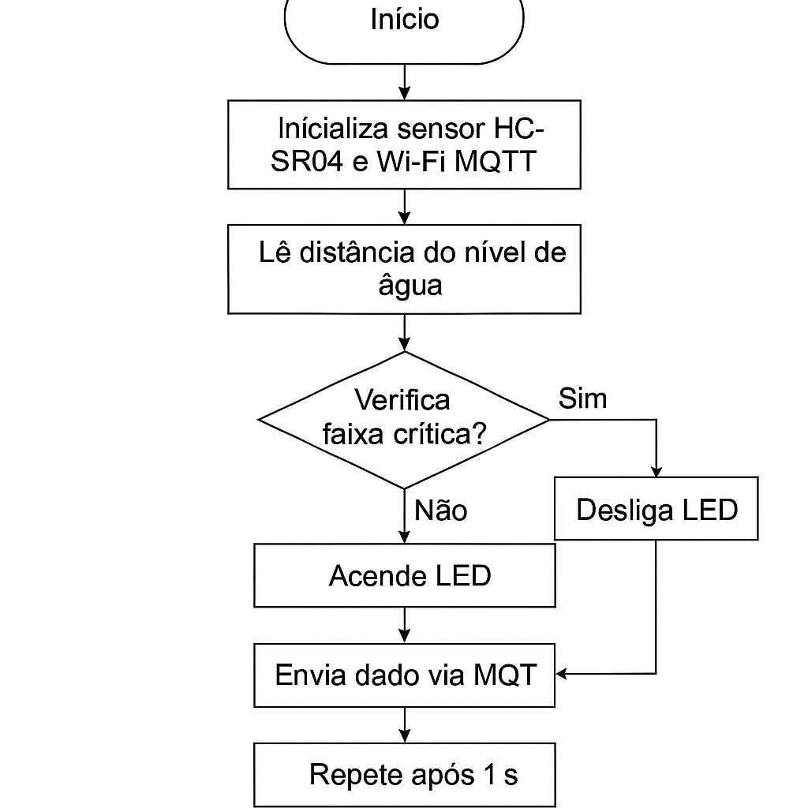
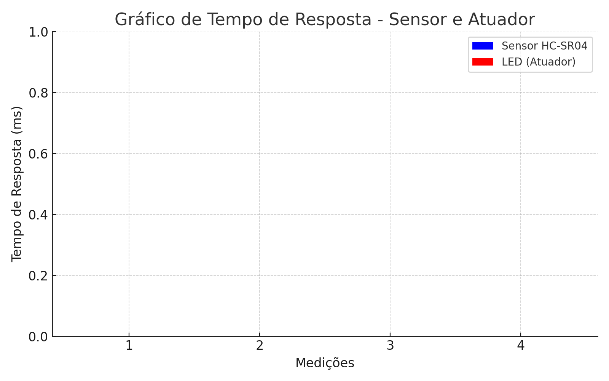

# 💧 Monitoramento Inteligente do Nível de Água via MQTT

Este projeto implementa um sistema de monitoramento de nível de água baseado em IoT, com foco na conservação e uso eficiente da água em reservatórios residenciais e comerciais. Ele utiliza o sensor ultrassônico HC-SR04, Arduino UNO, LED de alerta e simula a comunicação com o protocolo MQTT via mensagens no console.

---

## 🔧 Componentes utilizados

- Arduino Uno (plataforma de prototipagem)
- Sensor ultrassônico HC-SR04
- LED vermelho (atuador)
- Resistor de 220Ω
- Simulação via plataforma [Wokwi](https://wokwi.com/)
- Protocolo de comunicação: MQTT (`test.mosquitto.org`)

---

## 📊 Funcionalidade

- O sensor detecta o nível da água simulando a aproximação de um obstáculo.
- Se a distância for inferior a 10 cm, o LED é acionado como alerta.
- O sistema simula a publicação dos dados via MQTT com a seguinte saída no console:

---

## 🔄 Fluxograma

---

## 📈 Gráfico de Tempo de Resposta

---

## 💡 Como testar

Você pode testar este projeto diretamente no simulador Wokwi com o código disponível na pasta `/Codigos/`. Basta colá-lo no `sketch.ino` e ajustar a distância simulada no sensor HC-SR04 clicando sobre ele.

---

## 🔗 Vídeo de Demonstração

---

## 📁 Código-fonte

O código-fonte está disponível em [`/Codigos/monitoramento_nivel.ino`](Codigos/monitoramento_nivel.ino).

---

## 📝 Licença

Projeto acadêmico desenvolvido para a disciplina **Objetos Inteligentes Conectados** – Universidade Presbiteriana Mackenzie.

